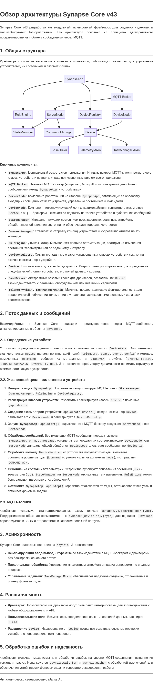

# Обзор архитектуры Synapse Core v43

Synapse Core v43 разработан как модульный, асинхронный фреймворк для создания надежных и масштабируемых IoT-приложений. Его архитектура основана на принципах декларативного программирования и обмена сообщениями через MQTT.

## 1. Общая структура

Фреймворк состоит из нескольких ключевых компонентов, работающих совместно для управления устройствами, их состоянием и автоматизацией:

**Ключевые компоненты:**

*   **`SynapseApp`**: Центральный оркестратор приложения. Инициализирует MQTT-клиент, регистрирует классы устройств и правила, управляет жизненным циклом всего приложения.
*   **`MQTT Broker`**: Внешний MQTT-брокер (например, Mosquitto), используемый для обмена сообщениями между `SynapseApp` и устройствами.
*   **`ServerNode`**: Компонент, работающий на стороне `SynapseApp`, отвечающий за обработку входящих сообщений от всех устройств, управление состоянием и командами.
*   **`DeviceNode`**: Компонент, инкапсулирующий логику взаимодействия конкретного экземпляра `Device` с MQTT-брокером. Отвечает за подписку на топики устройства и публикацию сообщений.
*   **`StateManager`**: Управляет текущим состоянием всех зарегистрированных устройств, обрабатывает обновления состояния и обеспечивает корреляцию ответов.
*   **`CommandManager`**: Отвечает за отправку команд устройствам и корреляцию ответов на эти команды.
*   **`RuleEngine`**: Движок, который выполняет правила автоматизации, реагируя на изменения состояния, телеметрии или по заданному интервалу.
*   **`DeviceRegistry`**: Хранит метаданные о зарегистрированных классах устройств и ссылки на активные экземпляры устройств.
*   **`Config`**: Централизованное управление конфигурацией приложения, поддерживающее JSON-файлы и переменные окружения.
*   **`HADiscovery`**: Компонент для интеграции с Home Assistant через MQTT Discovery.
*   **`Device`**: Базовый класс для всех IoT-устройств. Разработчики расширяют его для определения специфической логики устройства, его полей данных и команд.
*   **`BaseDriver`**: Абстрактный базовый класс для драйверов, позволяющих `Device` взаимодействовать с реальным оборудованием или внешними сервисами.
*   **`TelemetryMixin`, `TaskManagerMixin`**: Миксины, предоставляющие функциональность для периодической публикации телеметрии и управления асинхронными фоновыми задачами соответственно.

## 2. Поток данных и сообщений

Взаимодействие в Synapse Core происходит преимущественно через MQTT-сообщения, инкапсулированные в объекты `Envelope`.

### 2.1. Определение устройств

Устройства определяются декларативно с использованием метакласса `DeviceMeta`. Этот метакласс сканирует класс `Device` на наличие аннотаций полей (`telemetry`, `state`, `event`, `config`) и методов, помеченных `@command`, собирая их метаданные в `ClassVar` атрибуты (`SYNAPSE_FIELDS`, `SYNAPSE_COMMANDS`, `SYNAPSE_EVENTS`). Это позволяет фреймворку динамически понимать структуру и возможности каждого устройства.

### 2.2. Жизненный цикл приложения и устройств

1.  **Инициализация `SynapseApp`**: Приложение инициализирует MQTT-клиент, `StateManager`, `CommandManager`, `RuleEngine` и `DeviceRegistry`.
2.  **Регистрация классов устройств**: Разработчик регистрирует классы `Device` с помощью `@app.device`.
3.  **Создание экземпляров устройств**: `app.create_device()` создает экземпляр `Device`, связывает его с `DeviceNode` и регистрирует в `DeviceRegistry`.
4.  **Запуск `SynapseApp`**: `app.start()` подключается к MQTT-брокеру, запускает `ServerNode` и все `DeviceNode`.
5.  **Обработка сообщений**: Все входящие MQTT-сообщения перехватываются `SynapseApp._on_mqtt_message`, которая затем передает их соответствующим `DeviceNode` или `ServerNode` для дальнейшей обработки. `DeviceNode` фильтрует сообщения по `device_id`.
6.  **Обработка команд**: `DeviceHandler` на устройстве получает команды, вызывает соответствующие методы `@command` (с учетом наличия аргумента `node`), и отправляет `COMMAND_ACK`.
7.  **Обновление состояния/телеметрии**: Устройства публикуют обновления состояния (`ds`) и телеметрии (`dt`). `StateManager` на `ServerNode` отслеживает эти изменения. `RuleEngine` может быть запущен на основе этих обновлений.
8.  **Остановка `SynapseApp`**: `app.stop()` корректно отключается от MQTT, останавливает все узлы и отменяет фоновые задачи.

### 2.3. MQTT-топики

Фреймворк использует стандартизированную схему топиков `synapse/v1/{device_id}/{type}`. Поддерживается обратная совместимость с `synapse/{device_id}/{type}` для подписок. `Envelope` сериализуется в JSON и отправляется в качестве полезной нагрузки.

## 3. Асинхронность

Synapse Core полностью построен на `asyncio`. Это позволяет:

*   **Неблокирующий ввод/вывод**: Эффективное взаимодействие с MQTT-брокером и драйверами без блокировки основного потока.
*   **Параллельная обработка**: Управление множеством устройств и правил одновременно в одном процессе.
*   **Управление задачами**: `TaskManagerMixin` обеспечивает надежное создание, отслеживание и отмену фоновых задач.

## 4. Расширяемость

*   **Драйверы**: Пользовательские драйверы могут быть легко интегрированы для взаимодействия с любым оборудованием или API.
*   **Пользовательские поля**: Возможность определения новых типов полей данных, расширяя `Field`.
*   **Расширение `Device`**: Наследование от `Device` позволяет создавать сложные иерархии устройств с переопределением поведения.

## 5. Обработка ошибок и надежность

Фреймворк включает механизмы для обработки ошибок на уровне MQTT-соединения, выполнения команд и правил. Используются `asyncio.wait_for` и `asyncio.gather` с обработкой исключений для обеспечения устойчивости фоновых задач и корректного завершения работы.

---

*Автоматически сгенерировано Manus AI.*
